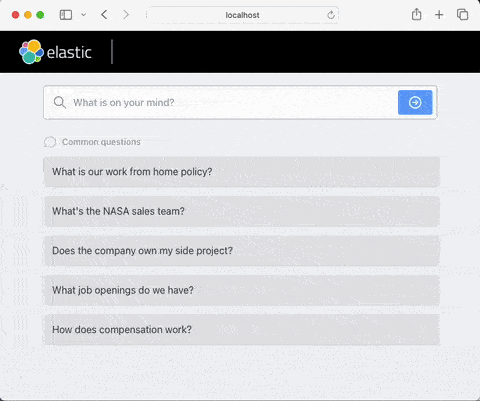

# Elastic Chatbot RAG App

**This is an simplfied and adapted version of Elastic Chatbot RAG App (https://github.com/elastic/elasticsearch-labs/tree/main/example-apps/chatbot-rag-app)**

This is a sample app that combines Elasticsearch, Langchain and a Azure to create a chatbot experience with ELSER and Channel News Asia content (Singapore). Chunking example is also provided.

**Requires at least 8.11.0 of Elasticsearch.**



## Download the Project

Download the project from Github and extract the `chatbot-rag-app` folder.

```bash
curl https://codeload.github.com/elastic/elasticsearch-labs/tar.gz/main | \
tar -xz --strip=2 elasticsearch-labs-main/example-apps/chatbot-rag-app
```

## Installing and connecting to Elasticsearch

### Install Elasticsearch

There are a number of ways to install Elasticsearch. Cloud is best for most use-cases. Visit the [Install Elasticsearch](https://www.elastic.co/search-labs/tutorials/install-elasticsearch) for more information.

### Connect to Elasticsearch

This app requires the following environment variables to be set to connect to Elasticsearch hosted on Elastic Cloud:

```sh
export ELASTIC_CLOUD_ID=...
export ELASTIC_API_KEY=...
```

You can add these to a `.env` file for convenience. See the `env.example` file for a .env file template.

#### Self-Hosted Elasticsearch

You can also connect to a self-hosted Elasticsearch instance. To do so, you will need to set the following environment variables:

```sh
export ELASTICSEARCH_URL=...
```

### Change the Elasticsearch index and chat_history index

By default, the app will use the `search-cna-docs` index and the chat history index will be `search-cna-docs-chat-history`. If you want to change these, you can set the following environment variables:

```sh
ES_INDEX=search-cna
ES_INDEX_CHAT_HISTORY=search-cna-docs-chat-history
```

## Connecting to LLM

We support several LLM providers. To use one of them, you need to set the `LLM_TYPE` environment variable. For example:

```sh
export LLM_TYPE=azure
```

The following sub-sections define the configuration requirements of each supported LLM.

### OpenAI

To use OpenAI LLM, you will need to provide the OpenAI key via `OPENAI_API_KEY` environment variable:

```sh
export LLM_TYPE=openai
export OPENAI_API_KEY=...
```

You can get your OpenAI key from the [OpenAI dashboard](https://platform.openai.com/account/api-keys).

### Azure OpenAI

If you want to use Azure LLM, you will need to set the following environment variables:

```sh
export LLM_TYPE=azure
export OPENAI_VERSION=... # e.g. 2023-05-15
export OPENAI_BASE_URL=...
export OPENAI_API_KEY=...
export OPENAI_ENGINE=... # deployment name in Azure
```

## Running the App

Once you have indexed data into the Elasticsearch index, there are two ways to run the app: via Docker or locally. Docker is advised for testing & production use. Locally is advised for development.

### Through Docker

Build the Docker image and run it with the following environment variables.

```sh
docker build -f Dockerfile -t chatbot-rag-app .
```

#### Ingest data

Make sure you have a `.env` file with all your variables, then run:

```sh
docker run --rm --env-file .env chatbot-rag-app flask create-index
```

See "Ingest data" section under Running Locally for more details about the `flask create-index` command.

#### Run API and frontend

You will need to set the appropriate environment variables in your `.env` file. See the `env.example` file for instructions.

```sh
docker run --rm -p 4000:4000 --env-file .env -d chatbot-rag-app
```

Note that if you are using an LLM that requires an external credentials file (such as Vertex AI), you will need to make this file accessible to the container in the `run` command above. For this you can use a bind mount, or you can also edit the Dockerfile to copy the credentials file to the container image at build time.

### Locally (for development)

With the environment variables set, you can run the following commands to start the server and frontend.

#### Pre-requisites

- Python 3.8+
- Node 14+

#### Install the dependencies

For Python we recommend using a virtual environment.

_ℹ️ Here's a good [primer](https://realpython.com/python-virtual-environments-a-primer) on virtual environments from Real Python._

```sh
# Create a virtual environment
python -m venv .venv

# Activate the virtual environment
source .venv/bin/activate

# Install Python dependencies
pip install -r requirements.txt

# Install Node dependencies
cd frontend && yarn && cd ..
```

#### Run API and frontend

```sh
# Launch API app
python3 -m flask run

# In a separate terminal launch frontend app
cd frontend && yarn install & yarn start
```

You can now access the frontend at http://localhost:3000. Changes are automatically reloaded.